# Bugatti Type 57G “Tank” – a 3D model built from scratch

[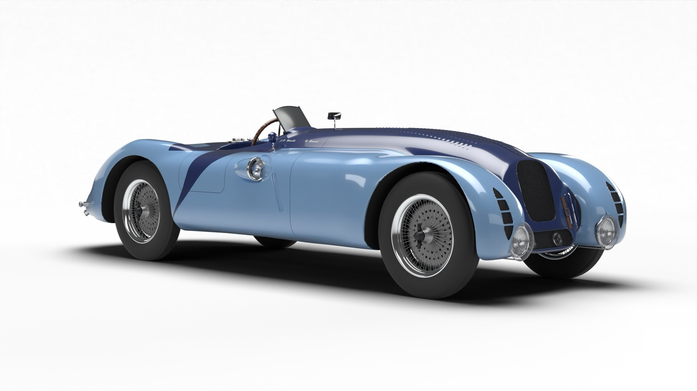](renders/01_hero_front_three_quarter.jpg)

A 3D model of the Bugatti Type 57G “Tank”, chassis 57335 (listed by the Simeone Museum as 57G 01). The car was built in 1936 and won the 1937 24 Hours of Le Mans with Jean-Pierre Wimille and Robert Benoist. It is the only surviving Tank and is on display at the Simeone Foundation Automotive Museum in Philadelphia.

All geometry was built with Python code in Blender 5.2; no downloaded 3D models were used. Photos of the real car served only as a reference for dimensions and lines.

## View in 3D

| | |
|---|---|
| **[Open the colour 3D viewer](https://hoanghuycptqt.github.io/bugatti-57g-tank/)** | Rotate, zoom and jump to preset views (nose, cockpit, tail…). Works on desktop and mobile. |
| **[View in 3D on GitHub](model/57G_Tank.stl)** | GitHub’s built-in STL viewer: a quick single-colour preview (~17k triangles, 1.9 MB). Detailed version for download or 3D printing: [`57G_Tank_hd.stl`](model/57G_Tank_hd.stl) (~184k triangles, 9.2 MB). |
| **[Download the full Blender file](https://github.com/hoanghuycptqt/bugatti-57g-tank/releases/latest)** | `Bugatti_57G_Tank.blend` (67.5 MB) with materials, studio and 16 cameras. |
| [`model/57G_Tank.glb`](model/57G_Tank.glb) | glTF 2.0 with Draco compression, 2.7 MB, about 0.92 million triangles. Works in web viewers, AR, three.js, Unity, Unreal… |

## Renders

Rendered in Cycles on a white studio background. Click an image to open the 2400 px original.

| | |
|:---:|:---:|
| [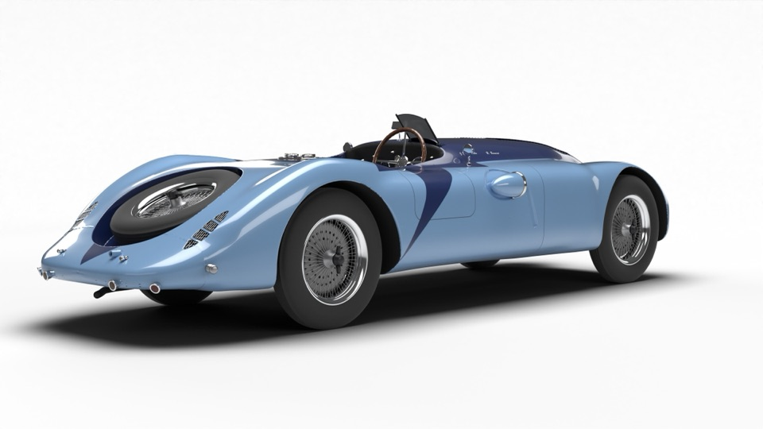](renders/02_hero_rear_three_quarter.jpg)<br>Rear three-quarter | [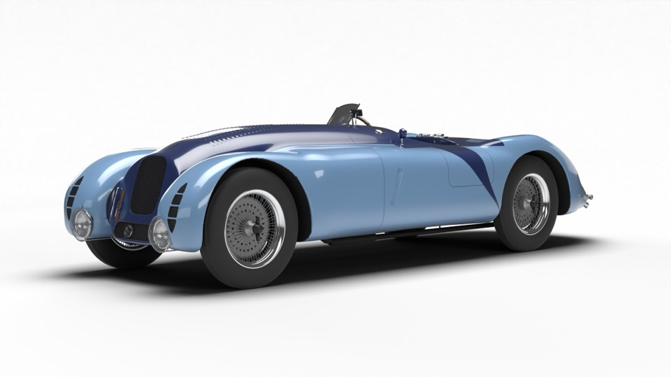](renders/04_front_three_quarter_left.jpg)<br>Front three-quarter, left side |
| [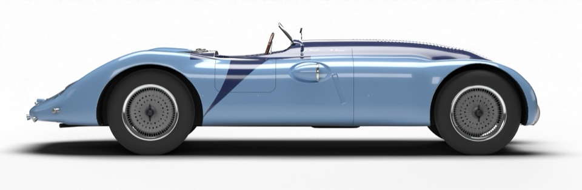](renders/03_side_right.jpg)<br>Right side | [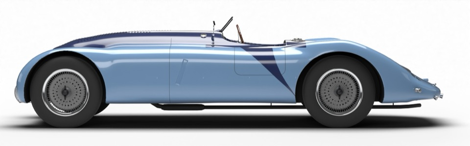](renders/07_side_left.jpg)<br>Left side |
| [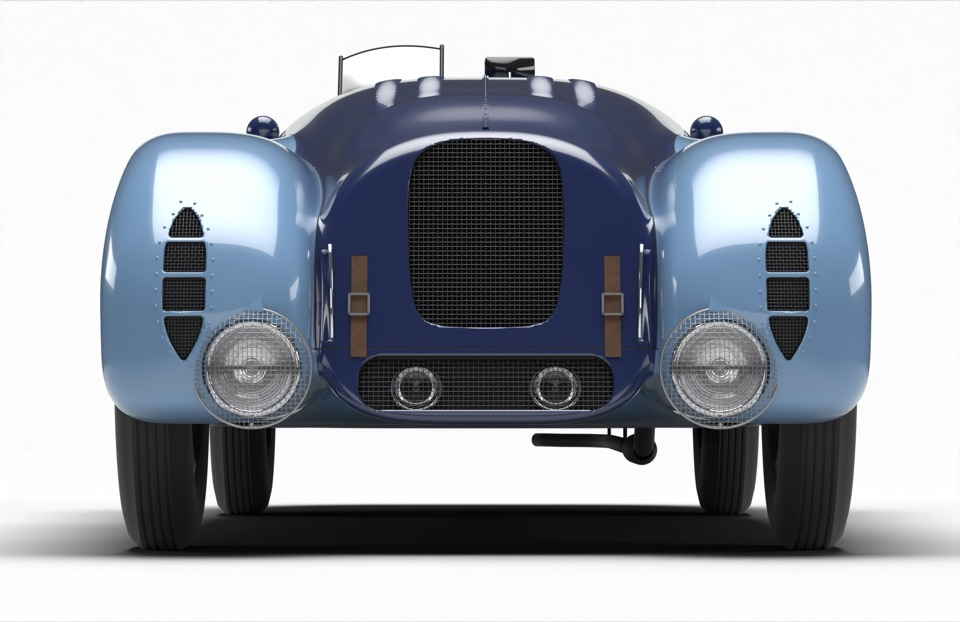](renders/05_front.jpg)<br>Front | [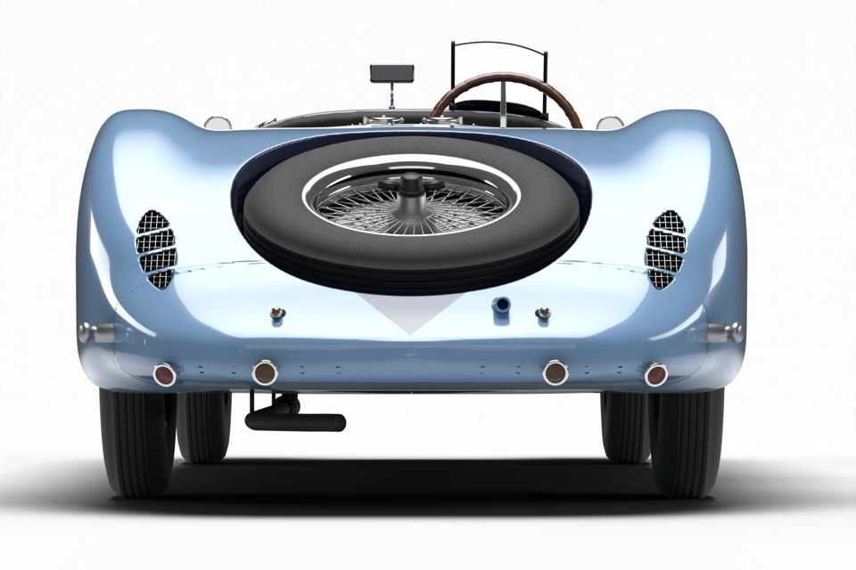](renders/06_rear.jpg)<br>Rear |
| [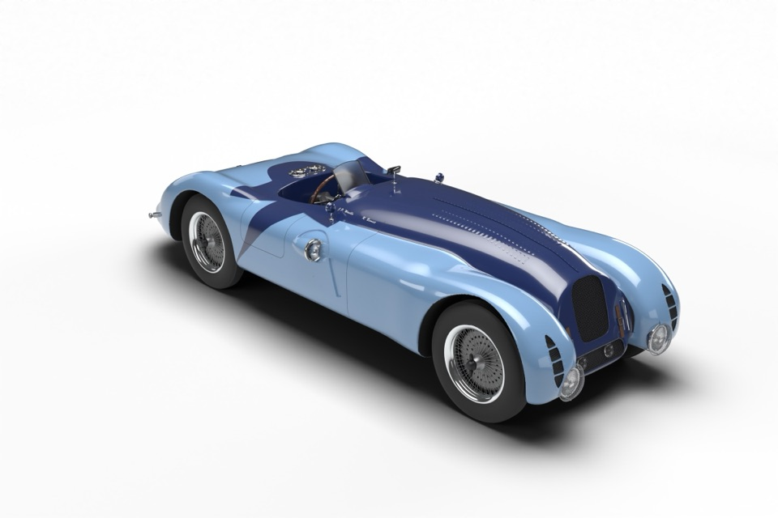](renders/08_high_three_quarter.jpg)<br>High three-quarter | [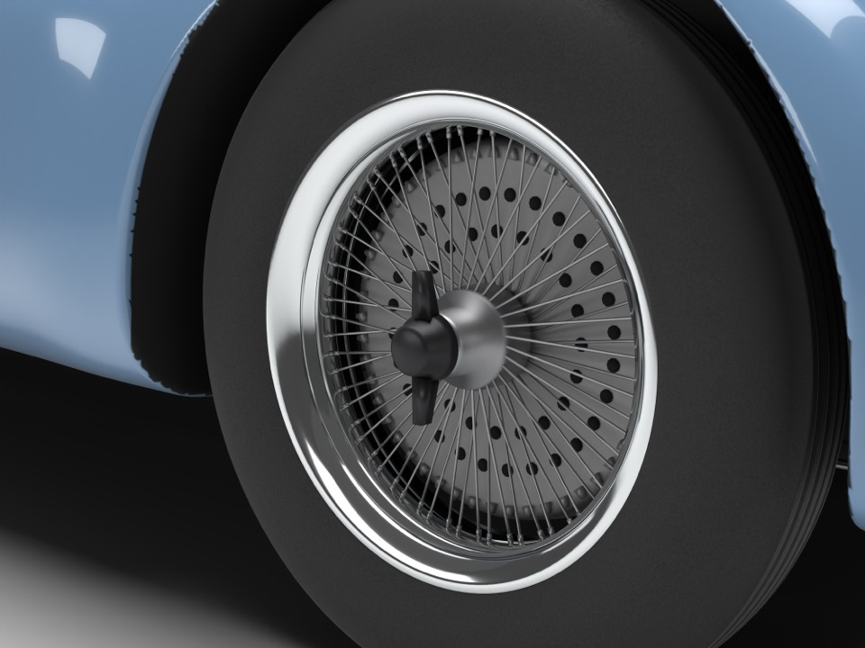](renders/13_detail_wheel.jpg)<br>64-spoke wire wheel and finned brake drum |
| [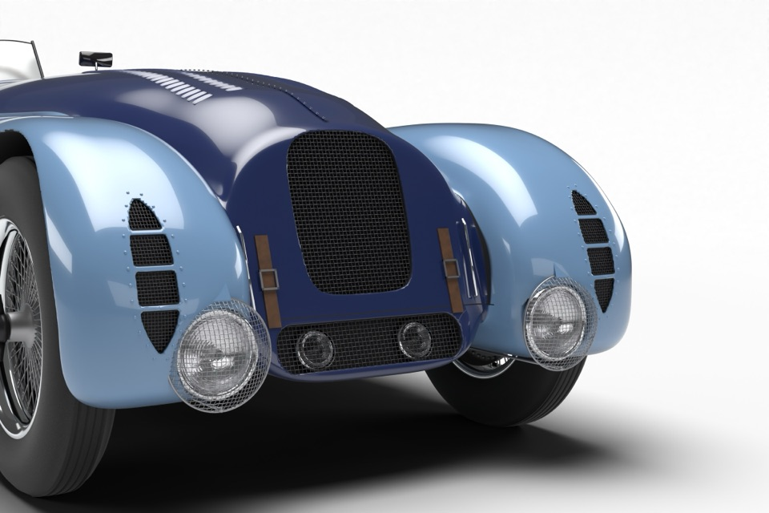](renders/09_detail_nose.jpg)<br>Nose: horseshoe grille, headlamps with mesh stone guards | [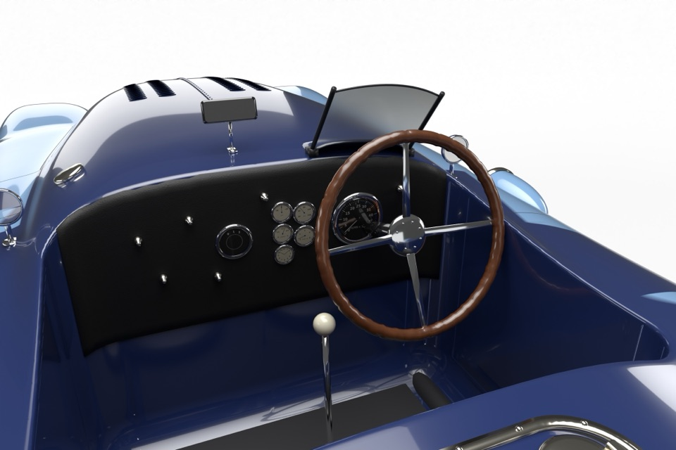](renders/10_detail_cockpit.jpg)<br>Cockpit: wooden steering wheel, dashboard, gauges |
| [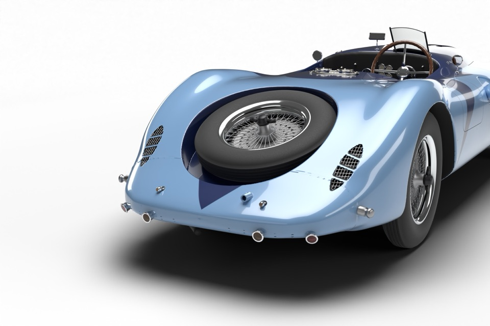](renders/11_detail_tail.jpg)<br>Tail: spare wheel, tail lamps, vent holes | [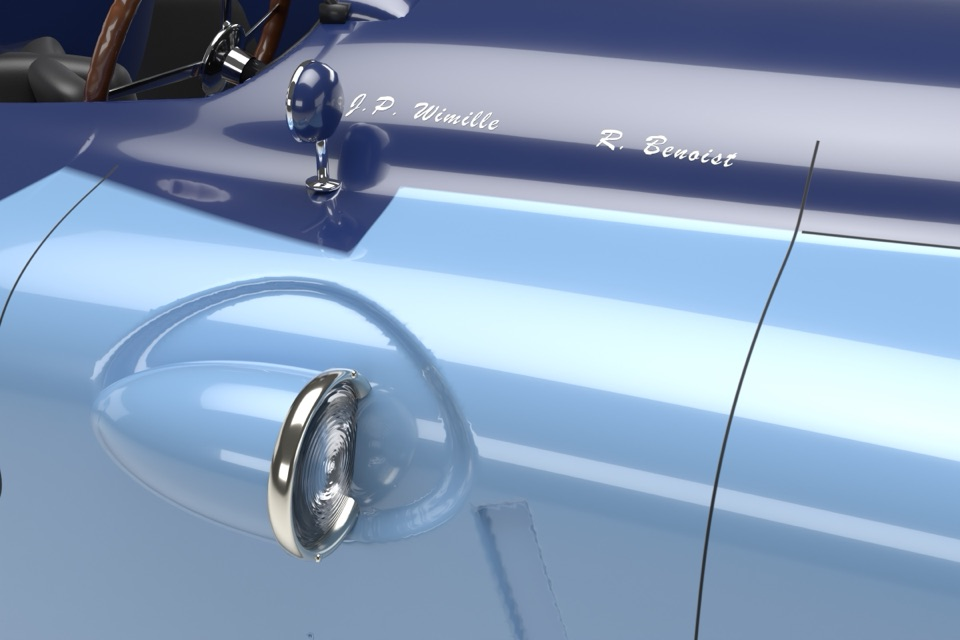](renders/12_detail_side_lamp.jpg)<br>Auxiliary lamp on the right-hand side |
| [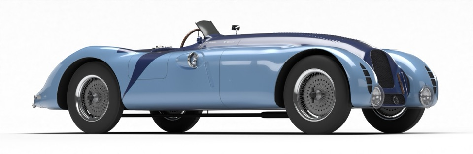](renders/14_match_museum_f3q.jpg)<br>Same camera angle as the museum photo (front three-quarter) | [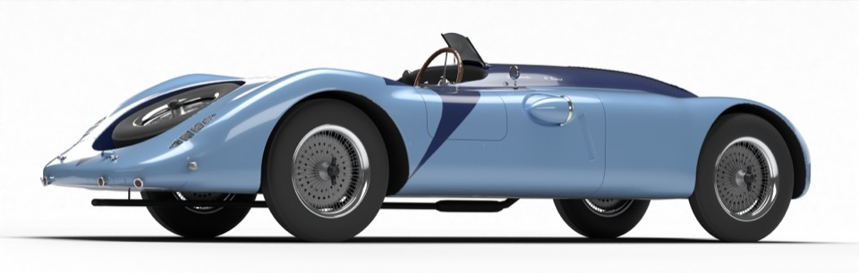](renders/15_match_museum_r3q.jpg)<br>Same camera angle as the museum photo (rear three-quarter) |

## Main dimensions

| Item | Value |
|---|---|
| Wheelbase | 2.98 m |
| Front/rear track | 1.35 m |
| Body length | ~4.75 m (~4.80 m including the headlamp guards and tail lamps) |
| Overall width | ~1.63 m |
| Body height (bonnet) | ~1.05 m |
| Height to the top of the windscreen | ~1.21 m |
| Tyres | 5.25/5.50-19, radius ~0.395–0.40 m |

## Match with the real car

- The side, front and rear silhouettes were compared column by column against the Simeone photos. Typical deviation is 1–3 cm.
- The cameras of the front and rear three-quarter photos were recovered with PnP from 10 landmarks (wheel centres, lamps, mirrors, windscreen…). Mean error is 6.7 px (front three-quarter) and 3.9 px (rear three-quarter) on 1200 px wide images.
- Renders 14 and 15 above use those camera angles, so they can be placed side by side with the museum photos.

## Modelled details

- **Body:** two-tone light blue and navy paint; the diagonal navy sweep on the flanks, the spare-wheel recess and the navy V below it; panel gaps (doors, side seams, bonnet edges), rivets and pressed louvres on the bonnet.
- **Nose:** horseshoe grille in real woven mesh, lower intake with two driving lamps, headlamps with mesh stone guards and brackets, four vents on each front wing, leather bonnet straps.
- **Sides and tail:** recessed auxiliary lamp on the right, twin fuel fillers, diagonal side slots, coarse-mesh tail vents, four tail lamps and eleven vent holes, spare wheel set at an angle into the tail, exhaust running under the left side.
- **Cockpit:** curved windscreen, central mirror and two round mirrors, black crackle-finish dashboard, French-lettered gauges, four-spoke wooden steering wheel, black leather bucket seats, ivory gear knob, and the names of the two drivers, Wimille and Benoist, on the bonnet as on the real car.
- **Wheels:** 64-spoke wire wheels, finned aluminium brake drums, eared knock-off spinners.

## How it was built

1. **The body** is a signed distance function (SDF) written in numpy: the main body, bonnet and four wings are superellipse cross-sections that change along the length, joined with smooth unions. The recesses (grille, vents, spare wheel) are cut with smooth subtraction.
2. The surface is extracted with marching cubes on a 5 mm grid (about 2.2 million triangles), then projected onto the exact surface with Newton steps and given analytic normals.
3. **Paint, panel gaps and dark areas** are computed as scalar fields on every vertex and fed to a Cycles shader, so the boundaries stay sharp without textures.
4. **Details** (woven mesh, lamps, wire wheels, cockpit…) are generated with bmesh in `scripts/build/`.
5. **Web version:** the body is reduced to about 0.48 million triangles and then cut exactly along the paint boundaries and panel gaps, so the GLB needs only flat colours, no textures, and compresses to 2.7 MB with Draco. The viewer page loads it through jsDelivr for speed. The quick-preview STL is a text file in millimetres kept under 2 MB: GitHub embeds text files of that size in the page, so the preview works even on a slow connection, while large binary files are fetched separately and may show “Unable to render code block”. The HD version is a binary file (in metres) whose body was remeshed evenly so it looks good with flat shading.

The model was built by Claude (Anthropic) driving Blender through MCP. All the code is in `scripts/`; the scripts contain absolute paths from the build machine and need editing before they are run.

## Repository layout

```
index.html            3D viewer page (GitHub Pages + model-viewer)
model/57G_Tank.glb    colour model (glTF 2.0, Draco-compressed)
model/57G_Tank.stl    quick preview for GitHub's STL viewer (text, millimetres)
model/57G_Tank_hd.stl detailed STL (binary, metres) for download or 3D printing
renders/              15 renders at 2400 px and a contact sheet (README thumbnails in renders/web/)
scripts/build/        body and detail modelling code (Python, numpy, scikit-image, bpy)
scripts/blender/      text blocks stored in the .blend file
scripts/render/       background render script and camera list
scripts/web/          web export (GLB, STL)
```

## Re-rendering

Download `Bugatti_57G_Tank.blend` from [Releases](https://github.com/hoanghuycptqt/bugatti-57g-tank/releases/latest), put it in the repository root and run:

```
blender -b Bugatti_57G_Tank.blend -P scripts/render/render_final.py -- scripts/render/jobs_final.json
```

Images are written to `renders/out/`. The script selects the Metal GPU (Mac); on other machines that step is skipped and Cycles uses the device configured in Blender.

## Trademarks

The model carries no logos or brand lettering: there is no badge on the nose and no text on the rims, the tyres or the gauge faces. The names “Bugatti” and “Type 57G Tank” are used only to identify the historic car; this project is not affiliated with Bugatti.

## References

- Simeone Foundation Automotive Museum – [1936 Bugatti 57G “Tank”](https://simeonemuseum.org/collection/1936-bugatti-57g-tank/). Photos © Michael Furman, used only for reference and not included in this repository.
- Wikipedia – [Bugatti Type 57](https://en.wikipedia.org/wiki/Bugatti_Type_57)
- Classic Driver – [Le Mans-winning Bugatti Tank: first and last, a rare breed](https://www.classicdriver.com/en/article/cars/le-mans-winning-bugatti-tank-first-and-last-a-rare-breed)
